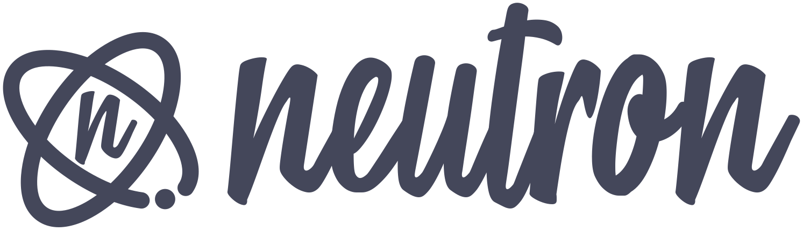

<h1 align="center">
  
</h1>
<div align="center">
  The best tool to speed up your development process! 💻️
</div>
<div align="center">

[](https://www.npmjs.com/package/@somadevs/neutron)<space><space>
[](https://travis-ci.org/somadevs/neutron)<space><space>

</div>

## Overview

This CLI was developed to help developers create new projects quickly and easily.

#### Templates and Scaffold

- [x] ReactJS
- [ ] React Native
- [ ] Node REST API
- [ ] Node GraphQL API

## Quick Start

To install Neutron CLI, execute into your terminal:

```shell
$ npm i @somadevs/neutron -g
```

Command list:

```shell
$ neutron -h

  neutron                -
  react add:component    Add new component files
  react add:duck         Add new duck file
  react add:page         Add new page files
  react add:saga         Add new saga file
  react create           Create new react app with duck pattern
  help (h)               -
  version (v)            Output the version number
```

## What's under the hood?

⭐ [create-react-app](https://github.com/facebook/create-react-app) to create a project basis <br/>
⭐ [gluegun](https://github.com/infinitered/gluegun) toolkit for building node-based command-line interfaces

## Contributing

Thanks for your interest on our project. Take a moment to read our guidelines:

- [Contributing](.github/CONTRIBUTING.md)
- [Code of Conduct](.github/CODE_OF_CONDUCT.md)

## License

MIT © [Somadevs](https://github.com/somadevs)
